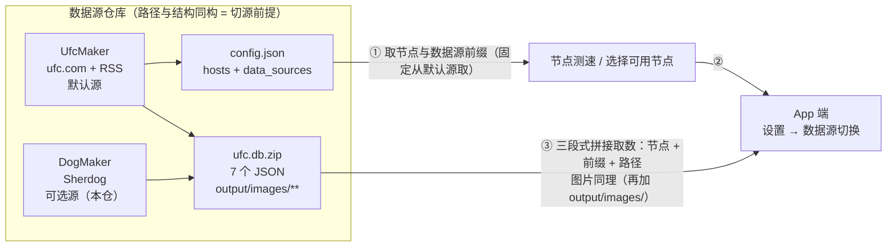
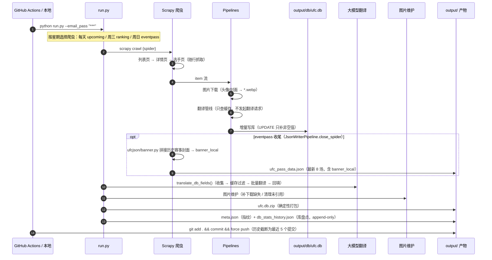
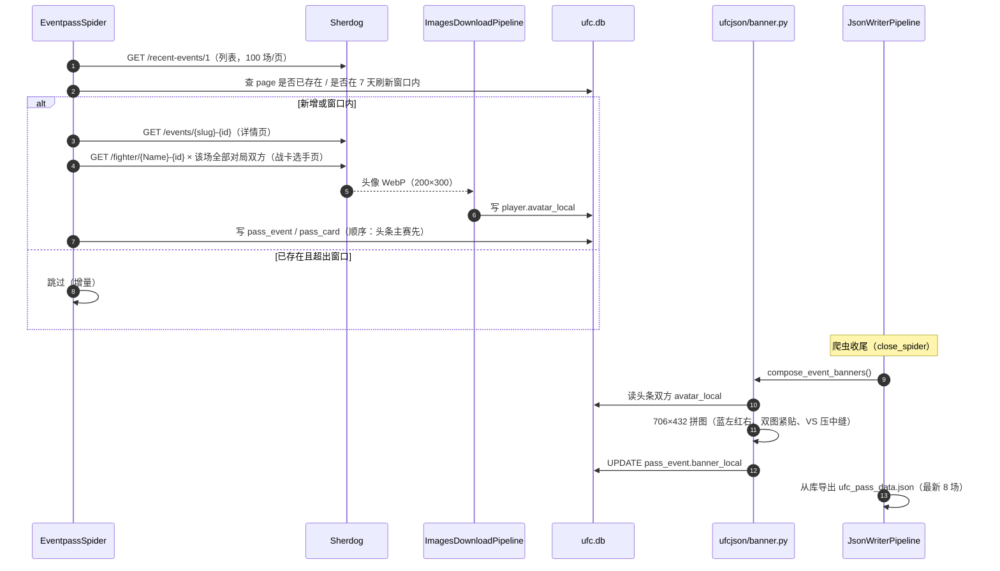

# DogMaker — UFC 数据爬虫（Sherdog 数据源）

基于 Scrapy 的 UFC 数据爬虫。抓取**历史赛事战报 / 即将到来赛程 / 官方排名 / 选手档案**，产出
JSON + SQLite（zip）+ 本地化图片，与 [UfcMaker](https://github.com/lxlfpeng/UfcMaker)（ufc.com 数据源）
**路径与结构同构**，作为 App「设置 → 数据源」里可切换的第二数据源（Sherdog）。

> ⚠️ RSS（含 UFC 中文新闻）由 UfcMaker 负责，本仓库不产出。
> 本文档描述**当前（Sherdog 版）方案**；ufc.com 时代的遗留实现见文末附录。

## 方案路线

### 1. 双仓与下游消费



- **节点与数据源前缀**由 `config.json` 下发：Sherdog 的前缀 = `/lxlfpeng/DogMaker/refs/heads/main/`；
  端上把 `<当前节点>` 当**不透明字符串**原样三段相接，不得补斜杠、不得按 host/path 拆解重组。
- **切换数据源 = 连图片一起切**（图片 URL 也带前缀）——这是 DogMaker 的图片全部落在
  `output/images/` 同相对路径下的原因。
- **同构是切源的前提**：两仓必须有同名同路径的 7 个 JSON、`output/db/ufc.db.zip`（App 端 Room 声明的
  表 schema 必须一致）、`output/images/` 的相对路径结构；否则切源后页面全空或数据库更新直接崩。
- 契约与端上规则详见：《数据来源及图片地址》《Splash 启动流程与域名切换逻辑》，
  各爬虫的取证明细见 `plans/eventpass-sherdog.md`、`plans/upcoming-sherdog.md`、`plans/ranking-sherdog.md`。

### 2. 一次完整调度（时序图）

`run.py` 是唯一调度入口（本地 / CI 同一套）；GitHub Actions 每日触发并回推产物。



### 3. 单次 eventpass 抓取（时序图）

以历史赛事为例（`upcoming` / `ranking` 同构，只是列表入口不同）：



## 功能特性

- **赛程抓取** — 即将举行的 UFC 赛事（**Sherdog 源**：日期 / 举办地 / 全部对阵；⚠️ 无卡段时间、无赔率、无排名、无封面，见 `plans/upcoming-sherdog.md`）
- **历史战报** — 已结束赛事的完整对局数据（结束回合 / 结束方式 / 红蓝方结果等），支持全量分页与增量刷新
- **官方排名** — Sherdog 自家榜单（跨组织，13 档 × 10 人，`#1` 即冠军）
- **选手档案** — 由三个爬虫**随行抓取**选手页（姓名 / 昵称 / 头像 / 战绩 / 量级 / 身高 / 体重 / 生日 / 国籍 / 团队 / 胜场分布 / 历史）；⚠️ `cover`、`reach`、`style`、`status` 等为源站缺口
- **图片本地化** — 头像自动下载；**历史赛事封面由头条双方头像 Pillow 拼接生成**（源站无海报，见「封面拼接」章节）
- **自动翻译** — 两阶段：爬虫管线只查缓存，跑完后由 `run.py` 统一用大模型补齐中文
- **多格式导出** — JSON 文件 + SQLite 数据库（zip 下发）双写
- **定时调度** — `run.py` 按星期执行不同爬虫；GitHub Actions 每日触发并自动提交产物

## 项目结构

```
DogMaker/
├── run.py                    # 调度入口（按星期执行爬虫 → 收尾 → 打包发版产物）
├── scrapy.cfg                # Scrapy 项目配置
├── requirements.txt          # Python 依赖
├── ufcjson/                  # Scrapy 项目主目录
│   ├── items.py              # 数据结构定义（6 种 Item）
│   ├── settings.py           # 全局配置（管线顺序 / 图片目录 / 日志）
│   ├── middlewares.py        # 中间件（爬虫异常时邮件告警，可选）
│   ├── sherdog.py            # Sherdog 解析共用层（列表 / 详情 / 选手页，唯一实现）
│   ├── banner.py             # 历史赛事封面拼接（头条双方头像 → banner_local）
│   ├── export.py             # JSON 导出器（API 响应外壳封装）
│   ├── textutil.py           # 文本清洗（唯一实现，防 history 按位对齐错位）
│   ├── translate_cache.py    # 翻译缓存表建表 / 去重 / 唯一索引
│   ├── translator.py         # 翻译调度（阶段二：扫描 → 过滤 → 回填）
│   ├── llm_translator.py     # 大模型翻译后端（OpenAI 兼容接口）
│   ├── db_stats.py           # 库内容盘点（db_stats_history.json）
│   ├── spiders/              # 爬虫（共 3 个）
│   │   ├── upcoming.py       # 即将到来的赛事
│   │   ├── eventpass.py      # 历史赛事战报
│   │   └── ranking.py        # 官方排名
│   └── pipelines/            # 数据管道
│       ├── country_flag.py   # 国旗 / 国家代码处理
│       ├── image.py          # 图片下载 + 头像/封面非 URL 值归空（占位图已停用，见「注意点」）
│       ├── translate.py      # 翻译管线（阶段一：只查缓存）
│       ├── export_json.py    # JSON 导出 + eventpass 收尾拼封面
│       └── export_db.py      # SQLite 导出
├── scripts/                  # 辅助脚本（均在项目根目录执行）
│   ├── image_maintenance.py  # 图片维护（下载缺失 / 清理未引用）
│   ├── banner_maintenance.py # 历史赛事封面回填（存量补齐 / 改版式后重拼）
│   ├── send_email.py         # 邮件通知（爬虫异常告警）
│   └── clear_translations.py # 清空译文与翻译缓存（换翻译链路时全量重翻）
├── output/                   # 输出目录（产物见「输出产物」）
├── plans/                    # 各爬虫的取证与决策记录（*_sherdog.md）
└── log/scrapy_log.log        # Scrapy 日志（run.py 每次运行前删除重建）
```

## 数据结构（Items）

| Item 类 | 产出方 | 说明 | 主要字段 |
|--------|-------|------|---------|
| `UfcComingItem` | `upcoming` | 即将到来的赛事 | 名称 / 链接 / 主副早卡时间戳 / 举办地 / 赛事列表 |
| `UfcComingCardItem` | `upcoming` | 未开打战卡 | 量级 / 对阵双方主页 / 赔率 / 排名 |
| `UfcPassItem` | `eventpass` | 已结束赛事 | 同 coming + 从库生成 JSON |
| `UfcPassCardItem` | `eventpass` | 历史战卡 | 结束回合 / 结束时间 / 结束方式 / 红蓝方结果 |
| `UfcRankingItem` | `ranking` | 排名条目 | 选手名 / 级别 / 排名 / 主页（只落 JSON，不入库） |
| `UfcPlayerItem` | 三者随行 | 选手档案 | 姓名 / 昵称 / 头像 / 身高体重 / 生日 / 国籍 / 团队 / 战绩 / 历史 |

## 快速开始

### 环境要求

- Python 3.12（CI 使用 3.12；Scrapy 锁定 2.19.0，Pillow 锁定 12.3.0）
- 所有命令**必须在 DogMaker 根目录执行**（代码里是相对路径 `output/db/ufc.db` 等）

### 安装依赖

```bash
python -m venv .venv && source .venv/bin/activate
pip install -r requirements.txt
```

### 单独运行某个爬虫

```bash
# 即将到来的赛事（组织页 #upcoming_tab，约 9 场；顺带抓对阵双方选手页）
scrapy crawl upcoming
scrapy crawl upcoming -a limit=2          # 冒烟：只取前 2 场

# 历史赛事（Recent Events 第 1 页 = 近 2 年 100 场，日常增量）
scrapy crawl eventpass
scrapy crawl eventpass -a pagination=true # 全量分页回填（约 9 页 / 823 场）
scrapy crawl eventpass -a limit=5         # 冒烟：只取前 5 场

# 官方排名（/news/rankings/ 最新文章 → 13 档 × 10 人；顺带抓榜上选手页）
scrapy crawl ranking
```

> `eventpass` 收尾会自动拼接历史赛事封面并重新导出 `ufc_pass_data.json`，
> 单跑爬虫无需再执行任何补丁脚本。
> ⚠️ ufc.com 版 `athlete` 爬虫已移除（2026-09-30）——选手行改由上面三个爬虫随行写入。

### 使用调度入口运行

`run.py` 按星期自动选择爬虫，并在爬虫结束后执行固定收尾链路：

| 星期 | 爬虫 | 说明 |
|-----|------|------|
| 周三 | `ranking` | 周中更新排名（榜上选手行随行入库） |
| 周日 | `eventpass` | 周末更新比赛结果（含封面拼接） |
| 每天 | `upcoming` | 每日更新赛程 |

```bash
python run.py
python run.py --email_pwd your_password   # 传入邮箱密码后，爬虫异常会发告警邮件
```

**收尾顺序（不可调换）**：`翻译 → 图片维护 → ufc.db.zip 打包 → meta.json`。
`meta.json` 里的 `db_md5` / `db_zip_md5` 必须是**最终库**的指纹，客户端据此判断是否需要下载新库；
任一步骤失败只打警告、不中断整个流程。

### 维护脚本

| 命令 | 用途 |
|------|------|
| `python -m scripts.banner_maintenance` | 历史赛事封面**存量回填**（幂等，只补缺失） |
| `python -m scripts.banner_maintenance --force` | 封面**全量重拼**（改版式后用） |
| `python -m scripts.image_maintenance --download` | 补下载缺失图片并补全 `*_local` |
| `python -m scripts.image_maintenance --cleanup [--dry-run]` | 清理未被引用的孤儿图片 |
| `python -m scripts.image_maintenance --all` | 先补下载再清理（全量爬取后建议跑一次） |
| `python scripts/clear_translations.py` | 清空全部 `*_cn` 译文与翻译缓存（不可逆，会先备份 `.bak`） |

## 配置说明

核心配置在 `ufcjson/settings.py`：

```python
# 管道执行顺序（数字越小优先级越高）
ITEM_PIPELINES = {
   'ufcjson.pipelines.UfcCountryCodePipeline': 1,    # 国家代码处理
   'ufcjson.pipelines.UfcDefaultPhotoPipeline': 2,   # 占位图已停用（仅把非 URL 头像/封面归空）
   'ufcjson.pipelines.ImagesDownloadPipeline': 3,    # 图片下载
   'ufcjson.pipelines.TranslatorPipeline': 4,        # 翻译管线（只查缓存）
   'ufcjson.pipelines.JsonWriterPipeline': 300,      # JSON 导出（eventpass 收尾拼封面）
   'ufcjson.pipelines.SqliteDbPipeline': 300,        # SQLite 导出
}

IMAGES_STORE = '<项目根>/output/images'  # settings.py 里由 __file__ 推导为绝对路径
IMAGES_EXPIRES = 20000             # 图片过期天数（2 万天 ≈ 永不过期）
LOG_LEVEL = 'INFO'
LOG_FILE = './log/scrapy_log.log'
```

各爬虫的限流参数（`custom_settings`）：

```python
# Sherdog 会限流（被限时单请求 10s+）：低并发 + 固定延迟 + 自动限速
DOWNLOAD_DELAY = 1.5
CONCURRENT_REQUESTS_PER_DOMAIN = 1
AUTOTHROTTLE_ENABLED = True
RETRY_TIMES = 3
RETRY_HTTP_CODES = [500, 502, 503, 504, 522, 524, 408, 429, 403]
```

## 输出产物

```
output/
├── db/
│   ├── ufc.db                 # 主数据库（6 张表，见下）
│   ├── ufc.db.zip             # 端上下发的就是它（确定性打包，deflate 9）
│   └── ufc_translate.db       # 翻译缓存库
├── json/
│   ├── ufc_coming_data.json   # 即将到来的赛事
│   ├── ufc_pass_data.json     # 历史赛事战报（最新 8 场）
│   ├── ufc_ranking_data.json  # 官方排名
│   ├── config.json            # 节点 / 数据源引导文件（见「注意点」）
│   ├── meta.json              # 数据版本元信息（指纹）
│   ├── db_stats_history.json  # 库内容盘点趋势（append-only）
│   └── app_version.json       # App 版本 & 升级配置（手动维护）
└── images/
    └── full/                  # 图片（webp）：
                               #   下载图 = URL 的 SHA1
                               #   拼接封面 = SHA1("banner|" + 赛事页 URL)
```

> ⚠️ 这里**没有 `rss/`**：RSS 产物由 UfcMaker 产出，DogMaker 不生成。

### ufc.db — 主数据库

**6 张表**：`pass_event` / `pass_card` / `player` / `player_url_alias` / `player_url_probe` / `sqlite_sequence`。

#### pass_event — 历史赛事

| 字段 | 类型 | 说明 |
|------|------|------|
| `id` | INTEGER | 主键，自增（**库内 id 升序 = 卡序**，App 依赖同序） |
| `name` | TEXT | 赛事名称（如 `UFC 331`） |
| `name_cn` | TEXT | 赛事名称（中文） |
| `title` | TEXT | 头条主赛标题（如 `Van vs. Pantoja 2`） |
| `title_cn` | TEXT | 头条主赛标题（中文） |
| `city` / `country` | TEXT | 举办城市 / 国家（英；从 `address` 拆段——首段=城市、末段=国家，单段=国家；2026-10-02 恢复） |
| `city_cn` / `country_cn` | TEXT | 举办城市 / 国家（中；翻译回填） |
| `banner` | TEXT | 赛事横幅**原图 URL**——Sherdog 源恒为空（App 本页禁用原图） |
| `banner_local` | TEXT | 赛事横幅本地路径（**拼接封面**，见「封面拼接」） |
| `address` | TEXT | 举办地（拆段：`City,Region,Country`，已去场馆、国家别名归一） |
| `address_cn` | TEXT | 举办地（中文） |
| `page` | TEXT | 赛事详情页 URL（唯一键） |
| `main_time` | TEXT | 主卡开始时间戳（**字符串形式的 Unix 秒，UTC 00:00**） |
| `prelims_time` | TEXT | 副卡开始时间戳（Sherdog 无卡段时间 → 空） |
| `data_early_time` | TEXT | 早卡开始时间戳（同上 → 空） |

#### pass_card — 历史战卡对阵

| 字段 | 类型 | 说明 |
|------|------|------|
| `id` | INTEGER | 主键，自增（**写入顺序 = 卡序**：头条主赛先、其后 Match 降序） |
| `fight_page` | TEXT | 所属赛事详情页 URL |
| `blue_page` / `red_page` | TEXT | 蓝方 / 红方选手主页 URL（`red_page` = Sherdog 页左侧选手） |
| `blue_result` / `red_result` | TEXT | 红蓝方结果（`win` / `loss` / …） |
| `blue_odds` / `red_odds` | TEXT | 赔率（Sherdog 无 → 空） |
| `end_method` / `end_method_cn` | TEXT | 结束方式（英 / 中） |
| `end_round` / `end_time` | TEXT | 结束回合 / 结束时刻 |
| `card_type` | TEXT | 战卡类型——Sherdog 无分区标记 → **全量 `Main`** |
| `card_division` / `card_division_cn` | TEXT | 体重级别（英 / 中；约 2009 及更早赛事源站为空） |

#### player — 运动员档案

| 字段 | 类型 | 说明 |
|------|------|------|
| `id` | INTEGER | 主键，自增 |
| `name` / `name_cn` | TEXT | 姓名（英 / 中） |
| `nick_name` / `nick_name_cn` | TEXT | 昵称（英 / 中） |
| `page` | TEXT | 选手主页 URL（唯一键，带稳定 id） |
| `division` / `division_cn` | TEXT | 体重级别（英 / 中） |
| `avatar` / `avatar_local` | TEXT | 头像 URL（200×300 竖版；兜底 og:image 方图）/ 本地路径 |
| `cover` / `cover_local` | TEXT | 全身照——Sherdog 源站缺口，恒为空 |
| `record` | TEXT | 战绩（如 `20-3-0`） |
| `age` | TEXT | 年龄 |
| `status` / `status_cn` | TEXT | 状态（源站缺口 → 空） |
| `home_town` | TEXT | 出生地原始值（如 `Huntington Beach, United States`） |
| `city` / `city_cn` | TEXT | 城市（拆分自 `home_town`，仅国家时为空） |
| `country` / `country_cn` | TEXT | 国家 |
| `team` / `team_cn` | TEXT | 所属团队 |
| `style` / `style_cn` | TEXT | 格斗风格（源站缺口 → 空） |
| `height` / `weight` | TEXT | 身高 / 体重（英寸、磅） |
| `reach` / `leg_reach` | TEXT | 臂展 / 腿长（源站缺口 → 空） |
| `debut` | TEXT | UFC 首秀日期 |
| `history` / `history_cn` | TEXT | 历史对战记录（JSON 字符串，**按位对齐**） |
| `wins_stats` / `wins_stats_cn` | TEXT | 获胜方式统计（JSON 字符串） |
| `flag` | TEXT | 国旗代码 |

#### player_url_alias / player_url_probe — 历史辅助表（空表）

ufc.com 时代的「选手 URL 归并 / 301 对账」机制随数据源切换整体移除，这两张表由导出管道
建表后保持为空（App 端 Room 未声明，多出的表不影响启动）。详见文末附录。

### ufc_translate.db — 翻译缓存库

`translate`（原文 → 译文）+ `translate_miss`（问过大模型但没拿到译文的原文）两张表，
由 `ufcjson/translate_cache.py` 统一建表 / 去重 / 建唯一索引。完整流程见「中文翻译」章节。

### ufc_coming_data.json — 即将到来的赛事

```json
{ "code": 0, "msg": "success", "data": [ ... ], "timestamp": 1757759400000 }
```

`data` 为赛事数组，每场包含：`name` / `title` / `page` / `main_time` / `prelims_time` /
`data_early_time` / `address` / `address_cn` / `banner` / `fight_card`（战卡列表）。

### ufc_pass_data.json — 历史赛事战报

从数据库读取**最新 8 场**已结束赛事生成，结构同 coming，区别：
- 用 `url` 字段表示赛事链接；
- `fight_cards` 含结果字段（结束回合 / 方式 / 红蓝方结果等）与 `banner` / `banner_local`。

### ufc_ranking_data.json — 官方排名

`data` 为排名条目数组：`name` / `page` / `rank_name` / `rank` / `rank_name_cn`
（榜单名暂无中文——`UfcRankingItem` 在管线里是 `pass`，库中也没有 ranking 表）。

### db_stats_history.json — 库内容盘点（append-only）

- 每条 = 一次「库内容快照」（表行数 / 字段覆盖率 / 分布），**最后一条就是当前状态**；
- 与上一条完全一致时**不追加**（避免每天一条纯时间戳噪声）；
- ⚠️ 口径：占位符（如赔率的 `-`）算「空」；列缺失记 `null` 不抛异常；`main_time` 是字符串需 `CAST` 后比较。
  详见 `ufcjson/db_stats.py` 模块 docstring。

### meta.json — 数据版本元信息

| 字段 | 类型 | 说明 |
|------|------|------|
| `schema_version` | int | 数据结构版本号（字段/表结构不兼容变更时 +1） |
| `last_updated` / `last_updated_ts` | string / int | 内容最后变更时间（东八区 ISO 8601 / Unix 秒） |
| `generator` | string | 生成方标识（固定 `UfcMaker`——继承该值，勿改） |
| `spiders_run` | array | 本次执行了哪些爬虫 |
| `athlete_count` / `pass_event_count` | int | 库内选手数 / 历史赛事数 |
| `upcoming_event_count` / `ranking_count` | int | 未开打赛事数 / 排名条目数 |
| `db_md5` / `db_size` | string / int | **解压后** `ufc.db` 的指纹与字节数 |
| `db_zip_md5` / `db_zip_size` | string / int | 实际下发的 `ufc.db.zip` 指纹与字节数 |
| `_db_data_version` / `_coming_hash` / `_ranking_hash` | 内部 | 下次对比「是否有更新」用，勿依赖 |

> **是否有更新**：任一指纹（库 data_version / coming hash / ranking hash / db_md5）变化即视为有更新；
> 内容没变时 `last_updated` 保持旧值（爬虫跑了但数据没变 = 不触发客户端下载）。
> 客户端流程：先用 `db_zip_*` 校验压缩包，解压后再用 `db_*` 校验库本体。

### app_version.json — App 版本 & 升级配置

手动维护，发版时更新。关键字段：`latest_version(_code)` / `minimum_version(_code)` /
`force_update` / `release_date` / `download_url` / `changelog.zh|en`。
⚠️ 强制升级判定以《升级弹窗》为准：本期**只用 `force_update`**，`minimum_version(_code)` 不参与判定。

## 封面拼接（历史赛事）

Sherdog 事件页唯一的事件图是 `image_vs/<id>`（**200×100** 的头像拼图 + 站点水印），
尺寸过小且非海报，不可作封面 —— 因此历史赛事封面由 **`ufcjson/banner.py` 用头条主赛双方头像
Pillow 拼接生成**（决策记录：`plans/eventpass-sherdog.md` §7 D3，2026-10-02 改判）。

| 项目 | 口径 |
|---|---|
| 尺寸 | **706×432** = App 封面带 353×216dp 的 2 倍图（同比例，端上 centerCrop 不裁切） |
| 版式 | 蓝方在左、红方在右，**双图紧贴无缝**，VS 圆徽**压在中缝**上 |
| 裁切 | 半区 cover 铺满，锚点偏上（0.15）—— 多年代样本实测不切头，裁掉的是下半身 |
| 命名 | `output/images/full/<sha1("banner\|" + 赛事页 URL)>.webp`，确定性命名、重拼覆盖 |
| 落库 | `pass_event.banner_local`；`banner`（原图）保持空串 |
| 兜底 | 头条双方头像缺失的赛事保持空串 → App 深色纯色底 + 渐变降级 |

**触发方式**：

- 自动：`eventpass` 爬虫收尾（`JsonWriterPipeline.close_spider`）先拼接、再导出 JSON；
- 手动：`python -m scripts.banner_maintenance [--force]`（存量回填 / 改版式后全量重拼）。

> ⚠️ 已知待对齐项：PRD §7.3 与设计画布（231:3）的封面带为 **353×172**，而 App 现行实现是
> **353×216**（layout/dimens）——属 App 与最新设计的既有差异，非本方案引入。
> 若 App 后续对齐为 172，需改 `banner.py` 的 `BANNER_H` 并用 `--force` 全量重拼（见 D3′）。

覆盖率实测（2026-10-02）：823 场历史赛事中 **819 场**已完成拼接，4 场因双方头像缺失走降级。

## 图片维护

图片可能出现两类不一致：**库里有 URL 但本地没图**（下载失败等）、**磁盘有图但库没引用**（历史遗留等）。

> ⚠️ **缺失头像/封面不再注入 ufc.com 占位图**（Sherdog 源）：抓不到就留空，
> `*_local` 为空时由 App 直接用「加载失败默认图」——不下载跨源资源、不把别家品牌图写进库。

```bash
python -m scripts.image_maintenance --download          # 补下载缺失（player.avatar/cover、pass_event.banner）
python -m scripts.image_maintenance --cleanup --dry-run # 预览将删除的孤儿图
python -m scripts.image_maintenance --cleanup           # 实际删除（交互确认）
python -m scripts.image_maintenance --all               # 补下载 + 清理（全量爬取后建议）
```

**命名规则**：下载图 = 原始 URL 的 SHA1 + `.webp`；拼接封面 = `banner|<赛事页 URL>` 的 SHA1 + `.webp`。
`avatar_local` / `cover_local` / `banner_local` 存相对路径（如 `full/abc123….webp`）。
⚠️ 清理脚本只扫 `.webp`、且以「数据库 + coming JSON 的引用集合」为白名单 —— 拼接封面
已被 `banner_local` 引用，不会被误删。

## 中文翻译

两阶段设计：爬虫阶段**不发起任何翻译请求**（只查缓存），爬完后由 `run.py` 统一用大模型补齐。

**阶段一（管线只查缓存）** —— `TranslatorPipeline`：命中缓存 → 写 `*_cn`；未命中 → 留空；
列表型字段（`history`）只要有一个元素未命中，整列不写、全部交给阶段二。

**阶段二（跑完后统一补翻）** —— `translate_db_fields()`：
收集「原文非空、译文为空」→ 缓存过滤 → 按批（默认 50 条）调用大模型 → 每批成功即写缓存 → 回填。
**幂等**：已翻译命中缓存跳过；失败批次不写缓存、下次自动重试。

| 表 | 字段（原文 → 译文） |
|---|---|
| `player` | `name` / `nick_name` / `city` / `country` / `division` / `status` / `team` / `style` |
| `pass_event` | `name` / `title` / `address` / `city` / `country` |
| `pass_card` | `end_method` / `card_division` |
| `player`（JSON 列） | `history` → `history_cn`（整列全成功才写）；`wins_stats` → `wins_stats_cn`（只翻 `way`） |

⚠️ `history` / `history_cn` 是**按位对齐**的 —— 抓取、翻译、订正三处必须使用
`ufcjson/textutil.py` 的同一个清洗函数，任何一处口径不同都会把 A 场的译文写到 B 场上。

### 配置（环境变量）

| 变量 | 说明 | 默认 |
|---|---|---|
| `LLM_API_BASE` | API 地址（OpenAI 兼容，如 `https://api.deepseek.com/v1`） | 空（必填） |
| `LLM_MODEL` | 模型名（如 `deepseek-chat`） | 空（必填） |
| `LLM_API_KEY` | API Key | 空（必填） |
| `LLM_BATCH_SIZE` / `LLM_TIMEOUT` / `LLM_MAX_RETRIES` | 每批条数 / 超时秒 / 重试次数 | `50` / `120` / `3` |

未配置（或未安装 `openai`）时打印提示并跳过，**不阻塞主流程**。CI 里从 Secrets 注入。

`llm_translator.py` 内置 MMA/UFC 领域提示词（量级、结束方式、人名音译、地点从大到小、日期 `YYYY年M月D日`），
并对模型返回做容错解析（剥 ```json 围栏、截首个 `[...]`、数量不足补空串）。

## 注意点

**运行与环境**

1. **必须在 DogMaker 根目录执行**所有命令（相对路径：`output/db/ufc.db`、`output/json/`、`./log/`）。
2. `run.py` 每次启动会**删除并重建** `log/scrapy_log.log`；日志只写文件、不刷屏（终端看不到输出属正常）。
3. **Sherdog 会限流**（被限时单请求 10s+）：三个爬虫均已内置 1.5s 延迟 + 单域串行 + AutoThrottle + 429/403 重试，不要调高并发。

**增量与幂等**

4. `eventpass` 默认**只抓第 1 页**（近 2 年 100 场）作日常增量；全量回填用 `-a pagination=true`。
5. 已入库赛事默认跳过；**7 天刷新窗口**内的赛事会重抓（防「赛果未出时入库、之后永不刷新」）。
6. 所有 UPDATE **只补非空值** —— 重抓不会清空已有数据（封面 `banner_local` 也因此不会被爬虫覆盖掉）。
7. 各类维护脚本均**幂等**，可反复执行（封面只补缺失、翻译命中缓存、zip 确定性打包）。

**数据口径（Sherdog 缺口 → 端上降级）**

8. `card_type` 全量 `Main`（源站无分区标记）；赔率、卡段时间、`cover` / `reach` / `style` / `status` 留空。
9. `main_time` 是**当天 00:00 UTC**（源站只到日）→ App 倒计时会提前归零，已登记为源站缺口。
10. `red_page` = **Sherdog 页面左侧**选手；App 全站展示「蓝左红右」→ 与源站观感互为镜像（口径一致，勿改）。
11. 女子量级仅 `Strawweight` 加 `Women's` 前缀（其余女子量级登记为已知差异）；约 2009 及更早赛事的量级为空。
12. 4 场源站无对局的赛事（UFC 151/176/233、FN 97）保留赛事行、`pass_card` 为空 → App 降级为待定占位。
13. `address` 已按「去场馆 → 拆段 → 国家别名归一（England/Scotland/Wales → United Kingdom）」处理，
    App 端依赖「第一段=城市、末段=国家」，**勿在派生层再加工**。

**图片与封面**

14. 图片一律走镜像相对路径 `*_local`（不自带域名）；App 拼 `<当前节点>+<前缀>+output/images/+<相对路径>`。
15. 拼接封面为确定性命名、重拼覆盖同一文件 —— 改版式后必须 `--force` 重拼，否则老文件不会更新。
16. 封面比例基准 = **App 现行 353×216**（非 PRD/画布的 172，见「封面拼接」的待对齐说明）。

**翻译**

17. 管线只查缓存、绝不发请求；本地验证翻译需自配 `LLM_*` 环境变量，否则翻译步骤直接跳过（不报错）。
18. `history` 系列是**按位对齐**，清洗必须走 `ufcjson/textutil.py`（见「中文翻译」警告）。

**发布与端上**

19. `ufc.db.zip` 是**确定性打包**（固定时间戳 / 权限位 / deflate 9）：同一份库产出逐字节相同的 zip，
    否则 CI 每天都会提交一个新的二进制 blob，仓库无限膨胀。
20. `meta.json` 指纹（`db_md5` / `db_zip_*`）必须对应**最终库**：所以打包一定排在翻译、图片维护**之后**。
21. App 取 `config.json` **固定走默认源（UfcMaker）**，不随数据源切换 —— 本仓 `output/json/config.json`
    仅为保持两仓同构与本地联调，端上不会从这里取。
22. CI（`.github/workflows/main.yml`）：push 到 main 或每日 07:45 UTC（**15:45 北京时间**）触发；
    跑完 `git add .` 全量提交（含 output 变更），并把历史**截断为最近 5 个提交**后 force push。
    Secrets 需要：`LLM_API_BASE` / `LLM_MODEL` / `LLM_API_KEY` / `EMAIL_TOKEN`。
23. **切数据源的前提是两仓同构**：同名同路径 JSON、`ufc.db.zip` 的表 schema 一致、
    `output/images/` 相对路径一致 —— 改动本仓产物路径 / 表结构时，必须同步评估端上切源。

## 数据来源

- **`eventpass` / `upcoming` / `ranking`**：抓取自 [Sherdog](https://www.sherdog.com) ——
  历史 / 未开打赛事来自 UFC 组织页（`#recent_tab` / `#upcoming_tab`），排名为其自家榜单
  （`/news/rankings/`，跨组织、每档 10 人、`#1` 即冠军），三者共用同一套详情页与选手页解析
  （`ufcjson/sherdog.py`）。`upcoming` / `ranking` 会**顺带抓相关选手页**写 `player` 表
  （否则 App 赛程页 / 排名页查不到选手，整片 TBD）。
  各爬虫的取证快照与决策见 `plans/eventpass-sherdog.md`、`plans/upcoming-sherdog.md`、`plans/ranking-sherdog.md`。
- ⚠️ **RSS（含 UFC 中文新闻）由 UfcMaker 负责**：App 的 RSS 地址固定走默认源（UfcMaker master），
  本仓库不再产出 RSS —— `ufccn_news` 爬虫、RSS 管线与 `output/rss/` 产物已于 2026-09-30 移除。
- ⚠️ **ufc.com 版 `athlete` 爬虫已移除**（2026-09-30）：它抓 ufc.com，会把 ufc.com 键的选手行灌回
  Sherdog 库。选手行现由上面三个爬虫随行抓选手页产出；「名册覆盖」（没上过战卡的选手）暂不补，
  决策见 `plans/eventpass-sherdog.md` §7 D5。

仅供学习研究使用。请遵守站点的使用条款，合理控制爬取频率。

## 依赖

见 `requirements.txt`：

- **Scrapy**（锁定 2.19.0）— 爬虫框架
- **Pillow**（锁定 12.3.0）— 图片处理（下载落 webp + 封面拼接）
- **openai**（>=1.0.0）— 大模型翻译客户端（OpenAI 兼容接口）
- **pycountry** — 国家代码查询
- **itemadapter** — Scrapy item 适配（中间件用）
- **requests** — 图片维护脚本下载

## 附录：ufc.com 时代的选手 Slug 归并（⚠️ 机制已移除，仅历史留档）

> ⚠️ 2026-09-30：随 DogMaker 切为 Sherdog 数据源，本节描述的机制（`ufcjson/normalize.py`
> 的多行合并 + `ufcjson/athlete_url.py` 的 URL 301 对账）**已整体移除** —— Sherdog 选手页
> URL 带稳定 id、不存在「改名拆行」，且选手行 `debut` 留空（合并键要求非空）⇒ 两步都是 no-op。
> 契约要求的 `player_url_alias` / `player_url_probe` 两张辅助表改由导出管道建表
> （`export_db.py` 的 player 分支），在 Sherdog 库中保持**空表**。下文为当时的实现记录。

### 问题从哪来

`player.page`（ufc.com 选手主页 URL）本来只是**网址的一段**，但项目把它当成了**选手的唯一标识**：

- `player.page` 是 `UNIQUE`，写入用 `INSERT OR REPLACE`（见 `pipelines/export_db.py`）；
- `pass_card.blue_page / red_page` 存的是选手主页 URL；
- 排名页和战卡页跳转选手详情，用的也是这个 URL。

ufc.com 改过亚洲选手的拼音顺序（如 `yadong-song` → `song-yadong`），同一个人的记录于是在库里断成两行：**战绩挂在旧 URL 上，而榜单给的是新 URL**，App 点进选手详情只查得到新 URL 名下那几场。

典型：宋亚东旧 URL 下 15 场、新 URL 下 4 场，用户在 App 里只看到 4 场。

### 怎么修

由 `ufcjson/normalize.py` 在**导出层**收尾（⚠️ 该模块已移除，见本节顶部说明），不改任何爬虫的抓取逻辑：

1. **分堆** — 按「归一化姓名 + 归一化首秀日」给 `player` 全表分堆，同一堆视为同一个人。
   - 姓名：NFKD 去音标 → 只留 `[a-z0-9]` → 小写（`Muhammad-Naimov` 和 `muhammad naimov` 归一）；
   - 首秀日：`Nov. 25, 2017` → `2017-11-25`。
   - ⚠️ 只用姓名会被同名不同人误伤：`bruno silva`（`bruno-silva-blindado` / `bruno-silva`）和 `joey gomez` 都是**真实的两个人**，靠首秀日才分得开。所以首秀日是必需的，不是可选项。
2. **选保留行** — 堆内 `record` 有效的行里，留 `id` 最大的那一行。
   - 依据：`player.id` 是 `AUTOINCREMENT`（严格递增、号不复用），而 `player` 的唯一写入者用 `INSERT OR REPLACE` 写 `page UNIQUE` —— REPLACE 的语义是**删旧行、重插新行**，每刷新一次 `id` 就变大一次，而旧 slug 从站点消失后再也抓不到。
   - 因此 **`id` 最大 = 最后被写入 = 站点当前 slug 行**。
3. **改写与落盘** — 其余行删除，同时把「旧 URL → 保留 URL」写进 `player_url_alias`，并按这张表改写 `pass_card.blue_page / red_page`。

### 两道保护

**① 空壳行守卫**（自动，无需配置）

只在 `record` 有效（总场次 > 0）的行里选 `id` 最大者；整堆都无效就整堆不动。防的是站点生成的空壳行 —— 例如 `casey-kenney-0` 的 `id` 比真行大得多，但没有战绩也没有任何 `pass_card` 引用，不挡就会反过来覆盖真数据。

**② 白名单**（`MERGE_WHITELIST`，需人工核对）

自动规则按「姓名 + 首秀日」分堆，够不着「首秀日也被改过」的情况。目前只有一条：

| 归一化姓名 | 保留的 URL | 说明 |
|---|---|---|
| `sumudaerji` | `.../athlete/su-mudaerji` | 两行首秀日不同（`Aug. 27, 2025` vs `Sep. 11, 2026`），但同昵称 `The Tibetan Eagle`、同战队 `Team Alpha Male`、同身高体重、同出身地，且被删行 history 的 8 个日期全部包含在保留行的 12 个里 |

新白名单项必须**逐项核对过人属性**才能加，键是归一化姓名，值是要保留的 `page`（须与库里的值逐字一致）。

### 历史战绩取并集

保留行的 `history` 通常已覆盖被删行，但偶尔会差一两场。合并时取并集（同日只留保留行那条），避免静默丢数据；history 变长后会同时清空 `history_cn`，否则翻译环节会误认为「已翻译」而跳过。

### 怎么跑（历史命令，模块已移除）

```bash
python -m ufcjson.normalize            # dry-run：只打印将合并的组/行数
python -m ufcjson.normalize --apply    # 真正落盘（先 VACUUM INTO 备份，单事务写入）
```

### 影响面（以 3248 行 `player` / 9010 行 `pass_card` 为样本实测）

| 项目 | 数值 |
|---|---|
| 多人组 | 23 组（自动 22 + 白名单 1） |
| 删除 `player` 行 | 23 行（3248 → 3225） |
| 改写 `pass_card` 行 | 129 行 |
| 整堆跳过 | 1 组（两行都是 `0-0-0`） |
| 战卡战绩对拍 | 严格匹配 7581 → 7631（新增的 50 场全部落进「一致」） |

### 与 Android 端的关系

- 只改数据，**不动 Room 实体**，`UFC_DB_VERSION` 不需要 +1；
- 新增的 `player_url_alias` 表 App 端不声明，Room 不会因为库里多表而报错。

> 局限：这套方案认定「`id` 最大 = 当前 slug」。若库被全量重建导致 `id` 重排，判据失效 —— 但那种情况下只要 `athlete.py` 的去重键是 `page`，同一人本来就不会留两行，多行问题也不会产生。